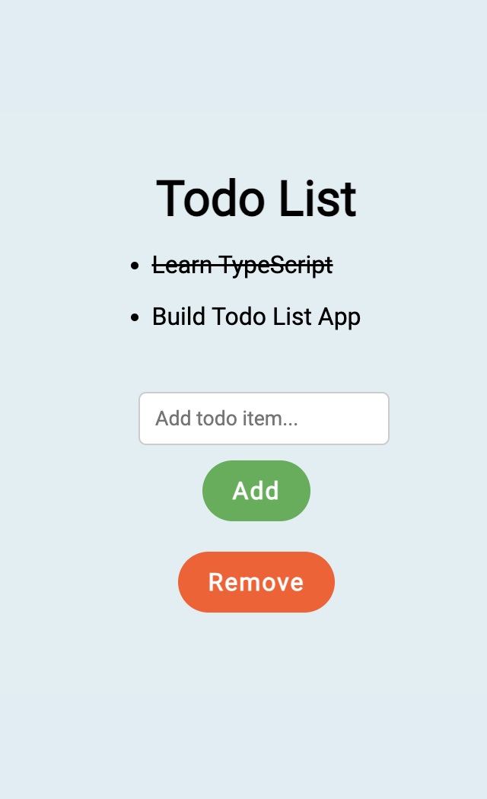

# Todo List App

This is a simple Todo List application built using React and TypeScript. It allows you to add and remove items from your todo list and mark them as completed.



## How to Use

Clone the repository to your local machine:


```bash
git clone <repository_url>
```

Install the dependencies:

```bash
npm install
```

Start the development server:

```bash
npm run dev
```
Open your browser and visit http://localhost:xxxx to see the Todo List app in action.


## Code Explanation

The main component of the Todo List app is TodoList, which uses React hooks (useState) to manage the state of the todo items and the input field.

The item interface defines the shape of a todo item, including an id, text, and completed flag.

The handleToggle function is responsible for toggling the completed flag of a todo item when the user clicks on it.

The handleClick function adds a new todo item to the list with the text entered in the input field.

The handleRemove function clears the entire list of todo items.


## Dependencies
- React: ^16.8.0
- TypeScript: ^4.1.0


## Credits

This Todo List app was created by Manuel Murillo. Feel free to use it and customize it for your own projects.

## License

[MIT](https://choosealicense.com/licenses/mit/)